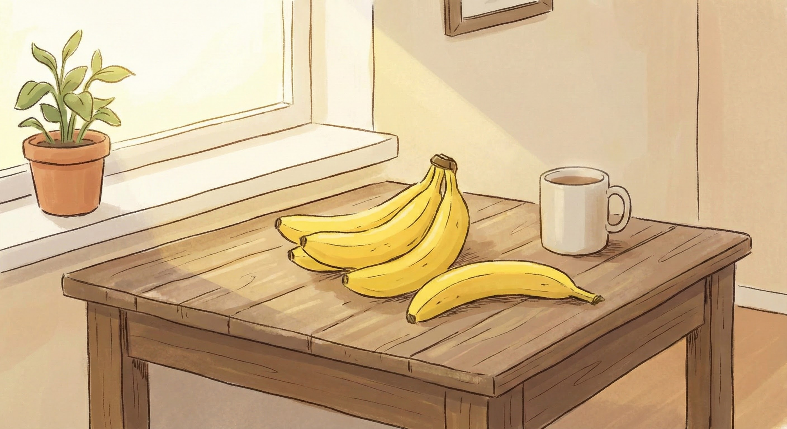

<style>
section {
  justify-content: flex-start;
  padding-top: 120px; /* 本文の開始位置 */
}
section h2 {
  position: absolute;
  top: 80px; /* 位置を調整 */
  left: 70px;
  margin: 0;
  border-bottom: 2px solid currentColor; /* 下線を追加 */
  padding-bottom: 5px; /* 下線と文字の間隔 */
  width: calc(100% - 140px); /* 左右の余白を考慮し、幅を調整 */
}
section.lead {
  justify-content: center;
  padding-top: 0;
}
section.lead h1, section.lead h2 {
  position: static; /* タイトルスライドでは通常の配置に戻す */
  border-bottom: none; /* リードスライドのh1/h2から下線を削除 */
  padding-bottom: 0;
  width: auto;
}
</style>

<!-- _class: lead -->

# Marp デモへようこそ！

Marp の機能紹介デモ
Markdown で書くプレゼンテーション

---

## 基本的な Markdown 機能

- **Markdown 記法**がそのまま使えます
- 箇条書きや強調も簡単
- `theme: gaia` などでテーマを変更可能
  - default, gaia, uncover が標準で使えます

---

## スライドごとのスタイル設定

このページだけ背景色を変えています。
`<!-- _backgroundColor: #e0e0e0 -->` のように、先頭に `_` をつけると**そのページのみ**に適用されます。

---

## プログラミング コードブロック

プログラミングのコードもきれいに表示できます。

```javascript
const greet = (name) => {
  console.log(`Hello, ${name}!`);
};

greet('Marp');
```

---

## 画像の配置とレイアウト

画像を背景に設定できます。透明度も指定可能。



### 右側に画像を配置する例

`` と書くと、右側40%を画像エリアにできます。

左側にテキスト、右側に画像というレイアウトが簡単に作れます。

---

## 美しい数式表現

数式も書けます。LaTeX記法をサポートしています。

$$
f(x) = \int_{-\infty}^\infty
    \hat f(\xi)\,e^{2\pi i \xi x}
    \,d\xi
$$

---

<!-- _class: lead -->
<!-- _color: white -->


# 全面背景画像の活用

文字色を白にして、背景画像の明度を下げると
文字が読みやすくなります。

---

## まとめと次のステップ

1. **簡単**に書ける
2. **PDF / PPTX / PNG / JPEG** に変換できる
3. **カスタマイズ**も豊富

Let's enjoy Marp!
ご不明な点があれば、またお気軽にご質問ください！
